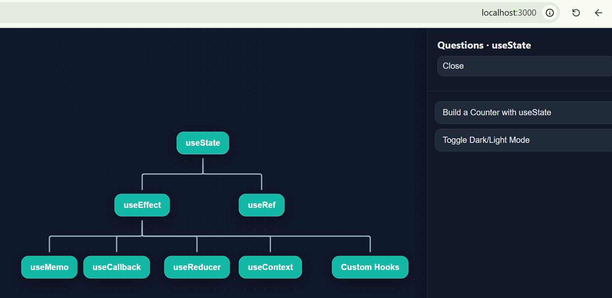
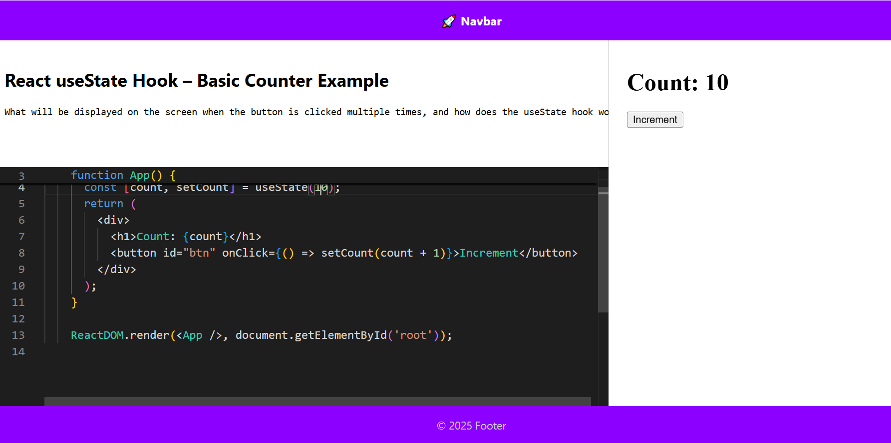

 # ReactRush

ReactRush is a coding challenge sandbox for practicing **React interview problems**.  
It provides an interactive environment to solve problems, test your solutions, and preview your code in real time.  
https://www.linkedin.com/company/react-rush/  


## 🚀 Features
- 📝 **Live Code Editor** – Write and edit your React code directly in the browser.  
- 👀 **Preview Panel** – Instantly see how your solution renders.  
- ✅ **Structured Test Cases** – Validate your solution with clear pass/fail feedback.  
- 🖥️ **Node.js Backend** – Server to safely run and test submitted solutions.  
- 🎯 **Interactive Practice** – Designed to strengthen your problem-solving and React skills.  

## 🛠️ Tech Stack
- **Frontend:** React, TailwindCSS  
- **Compiler/Preview:** Babel (standalone)  
- **Backend:** Node.js, Express (for solution testing)  
- **Database/Hosting (planned):** Firebase  

## 📸 Preview

Here’s an example of the interactive hooks roadmap:




## 📂 Project Structure
```
reactcraft/
├── client/           # React frontend
│   ├── src/components/
│   ├── src/data/
│   ├── App.jsx
│   └── index.js
├── server/           # Node.js backend
│   ├── routes/       # API routes for running tests
│   ├── services/     # Code execution logic
│   └── server.js
└── package.json
```

## 🚦 Getting Started

### Prerequisites
- Node.js (>= 18)
- npm or yarn

### Installation
```
# Clone the repo
git clone https://github.com/your-username/reactcraft.git
cd reactcraft

# Install client
cd client
npm install
npm start

# In another terminal: install and run server
cd ../server
npm install
npm run dev
```

## 📌 Usage
1. Start both the **client** and **server**.  
2. Open the app in your browser.  
3. Select a challenge from the list.  
4. Solve the problem in the code editor.  
5. Submit your solution → server runs tests → results shown in the UI.  

## 🤝 Contributing
Contributions are welcome!  
- Fork the repo  
- Create a new branch (`feature/your-feature`)  
- Commit your changes  
- Open a pull request  

## 📜 License
MIT License. Feel free to use and improve.  

## 🌟 Acknowledgements
Inspired by platforms like **LeetCode** and **CodeSandbox**, but focused specifically on **React interview prep**.
